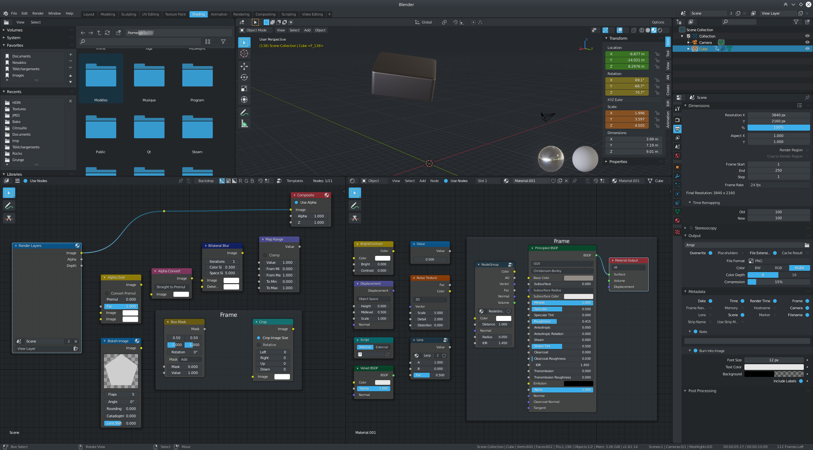
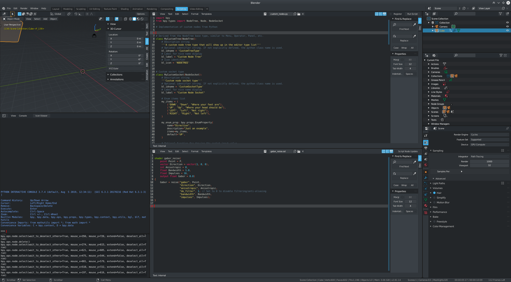

# Blender Theme

#### **Themes for Blender 2.8**

#### **How to Install :**

In user preferences -> Themes -> Install...
-> select the .xml file :)

---

#### **Breeze Dark :**

This theme mimics the color scheme of the Breeze Dark KDE theme

